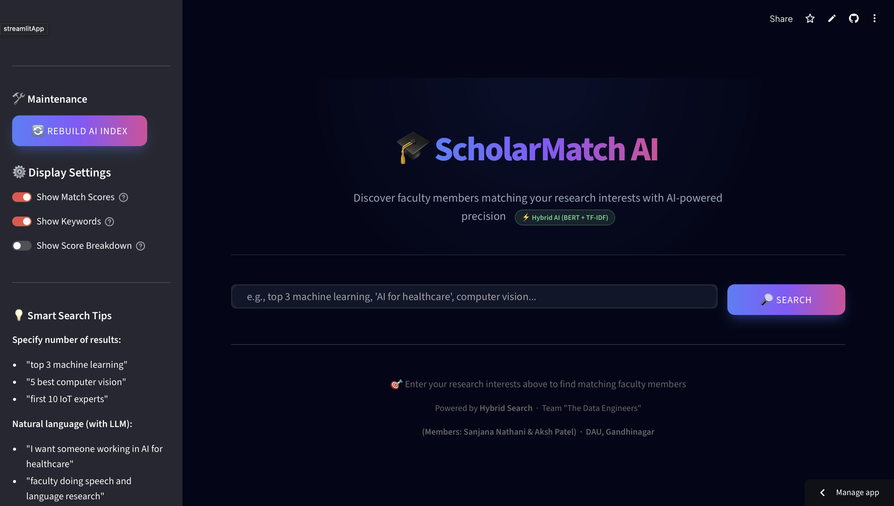
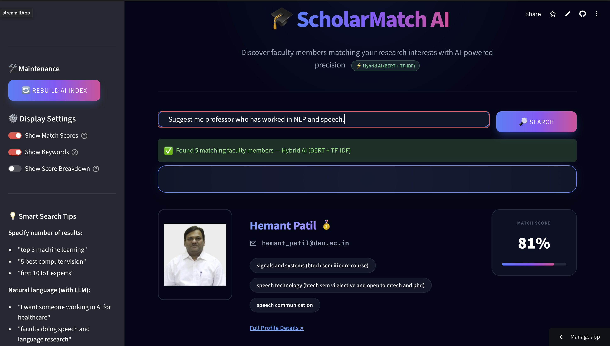
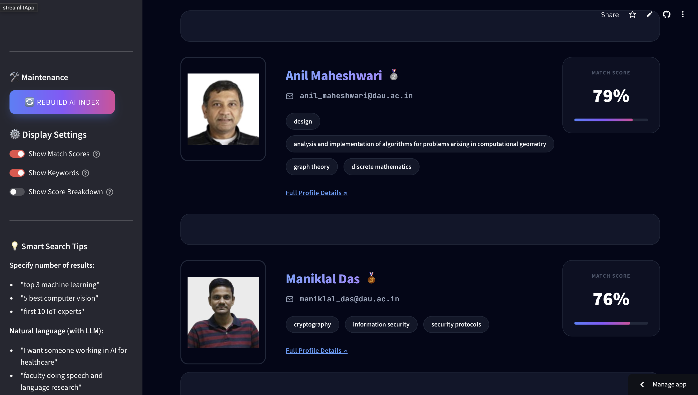
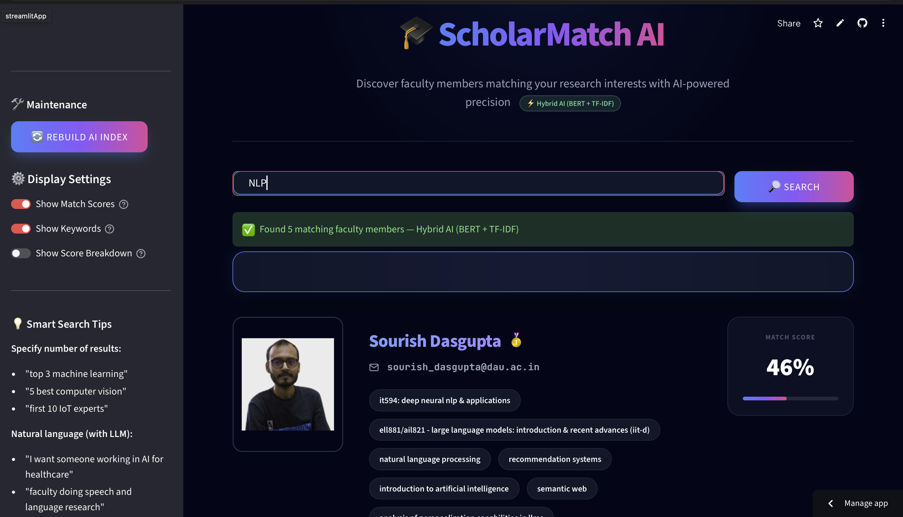
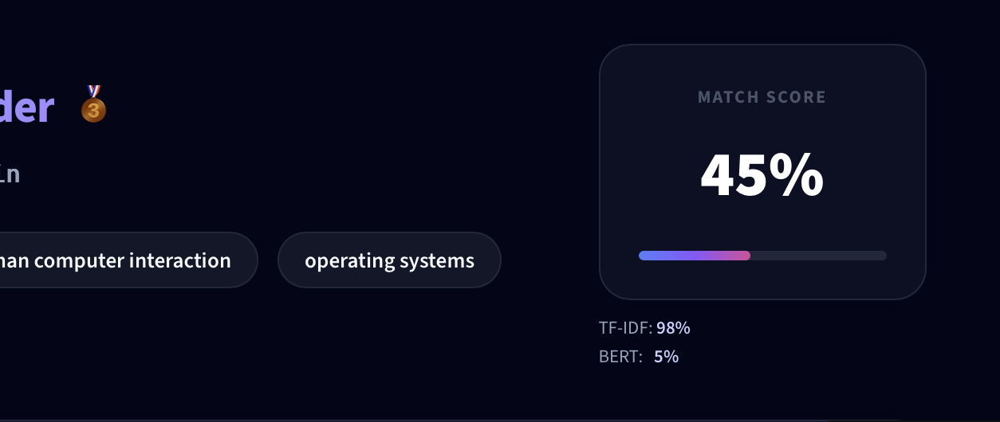

# DS614 - Big Data Engineering Project: ScholarMatch

**Live Deployment:** [https://ds614-faculty-finder-the-data-engineers.streamlit.app](https://ds614-faculty-finder-the-data-engineers.streamlit.app)

---

## Project Overview

This repository houses the complete end-to-end solution for the **DS614 Big Data Engineering** project, newly enhanced as **ScholarMatch**. It consists of two main components working in tandem:

1.  **Faculty Finder (Data Pipeline)**: A robust ETL pipeline that scrapes, cleans, and stores faculty data from the university website.
2.  **Faculty Recommender (AI Engine)**: An intelligent search engine that allows users to find faculty members based on research interests using a hybrid AI stack combining **Deep Learning (BERT)**, **Vector Databases (FAISS)**, and **Generative AI (Gemini)**.

---

## Repository Modules

The project is structured into two distinct modules, each responsible for a specific part of the system:

| Module | Description | Key Technologies |
| :--- | :--- | :--- |
| **[`DS614-Faculty-Finder`](./DS614-Faculty-Finder)** | **The Backend / Data Pipeline**. Handles data scraping (Ingestion), cleaning (Transformation), and storage (SQLite). | Python, Scrapy, Pandas, SQLite, FastAPI |
| **[`DS614-Faculty-Recommender`](./DS614-Faculty-Recommender)** | **The AI Frontend / Search Engine**. Implements the recommendation logic and user interface with hybrid semantic search. | BERT, FAISS, Gemini LLM, Streamlit, Pandas |

---

## Documentation & Setup

Each module handles its own dependencies and execution instructions. Please refer to the specific README files for detailed setup guides.

### 1. Data Pipeline Setup
For instructions on running the scraper, cleaning data, and querying the database, refer to:
👉 **[Faculty Finder Documentation](./DS614-Faculty-Finder/README.md)**

### 2. Search Application Setup
For instructions on running the recommendation engine, building the search index, and starting the web UI, refer to:
👉 **[ScholarMatch Recommender Documentation](./DS614-Faculty-Recommender/README.md)**

**Quick Start (Docker):**
The search application is containerized and can be run immediately with Docker:
```bash
docker build -t scholar-match .
docker run -p 8501:8501 scholar-match
```
---

## Recommendation Algorithm

**ScholarMatch** implements an industry-grade search stack that moves beyond simple keyword matching to a full semantic understanding:

- **Preprocessing**: Handles raw text by tokenizing, removing stopwords, and merging domain-specific phrases (e.g., "Machine Learning" becomes `machine_learning`).
- **Hybrid Vectorization (TF-IDF + BERT)**: Combines traditional TF-IDF keyword importance with **State-of-the-art BERT embeddings** (`all-MiniLM-L6-v2`) to understand both exact matches and semantic meaning.
- **Vector Database (FAISS)**: Uses **Facebook AI Similarity Search** to perform lightning-fast nearest-neighbor retrieval across high-dimensional faculty vectors.
- **Publication Intent Filter**: Automatically detects when a user is looking for research output and applies a score modifier to prioritize faculty with active publication records.
- **Generative AI Layer (LLM)**: Integrated with **Google Gemini** for smart query expansion (understanding user intent) and natural language result explanation ("Recommended because...").

---

## Deployment

The application is deployed on Railway and is accessible publicly for demonstration:
👉 **[ScholarMatch Production App](https://ds614-faculty-finder-production.up.railway.app)**

---

## Application Screenshots

The following screenshots demonstrate the ScholarMatch application in action:

### 🏠 Home Page - Search Interface


### 🔍 Search Example: Speech Recognition


### 📊 Faculty Results with Match Scores


### 💡 Search Example: NLP


### 🎯 Ranked Results Display


---

## Team

👩‍💻 **Sanjana Nathani**
- **Student ID:** 202518002  
- **Program:** M.Sc. Data Science  
- **Institution:** Dhirubhai Ambani University (DAU), Gandhinagar  
- **Role in Project:** AI Systems & Data Engineer  

👨‍💻 **Aksh Patel**  
- **Student ID:** 202518046  
- **Program:** M.Sc. Data Science  
- **Institution:** Dhirubhai Ambani University (DAU), Gandhinagar  
- **Role in Project:** Backend & Data Engineer  

---
*ScholarMatch is part of the larger DS614 Big Data Engineering project, demonstrating the end-to-end application of Modern AI and Data Engineering principles.*
